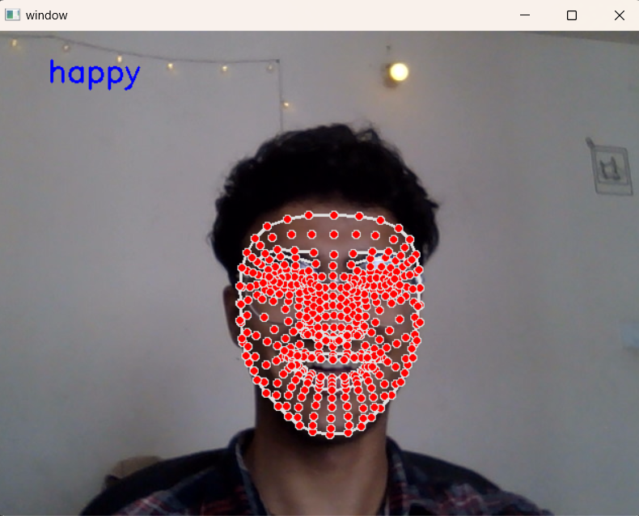

# liveEmoji

<h1>About the project</h1>
Emotion detection system based on data entry and data processing made using python libraries. 
The python libraries that you need to be familiar with to understand the working of this project are: 
<li>mediapipe</li>
<li>cv2</li>
<li>tensorflow keras model</li>
<li>numpy</li>

 

<h1>Connect with me</h1>
github : https://github.com/iwhe 
linkedin : https://www.linkedin.com/in/bhupeshpaneru 

